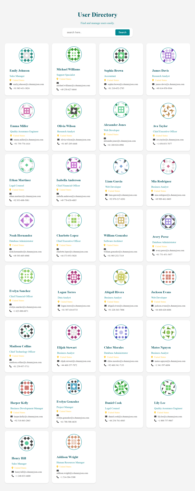

# 📇 User Directory Application

A clean, responsive, and dynamic web application that fetches user data from a public API and allows users to search and view user details instantly. The interface automatically adapts to desktop, tablet, and mobile layouts.

## 🚀 Live Preview
*(Optional: Add your deployed link here once you host it on GitHub Pages or Vercel)*
> 🔗 [https://userdirectory-api-project.netlify.app/](https://userdirectory-api-project.netlify.app/)

## ✨ Features

- **Dynamic Data Fetching:** Seamlessly pulls live user records from the `dummyjson.com/users` REST API.
- **Real-Time Search UI:** Instantly filter users by name or job title.
- **Embedded Clear Functionality:** A slick "X" icon inside the search input box appears while typing to clear queries quickly.
- **Fully Responsive Architecture:** Custom Grid layouts tailored for full desktop viewports, mid-size tablets (2 columns), and compact mobile layouts (single column).
- **Error Handling:** Gracefully handles network or API loading failures.


## 🛠️ Built With

*   **HTML5** - Structured semantic markup.
*   **CSS3** - Customized layout utilizing Flexbox, CSS Grid, and media query breakpoints.
*   **JavaScript (ES6+)** - Asynchronous programming (`async/await`), DOM manipulation, and dynamic client-side array filtering.
*   **Font Awesome** - Beautiful vector iconography for metadata properties.


## 📂 Project Structure

```text
├── index.html       # Application entry point and structure
├── style.css        # Responsive styling rules and responsive layout layers
├── script.js       # API fetching logic, rendering pipeline, and filtering event listeners
└── README.md        # Project documentation


## 📸 Screenshots




## 👨‍💻 Author

**Mrunali Mohite**

